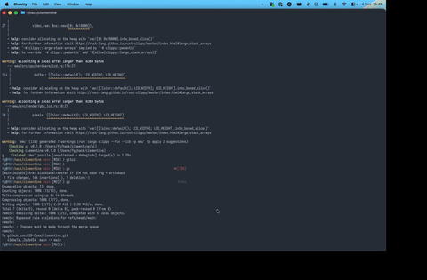

[](https://github.com/RIP-Comm/clementine/actions/workflows/rust.yml)



# Clementine - A collaborative approach to GBA emulation

Welcome to the first ripsters' project. Our goal is to understand how GameBoy Advance works and to create a modern emulator written in Rust (if you want to collaborate but you can't code in Rust take a look [here](https://doc.rust-lang.org/book/)).

Everything is work in progress. We will update this document a lot of times in this stage.


## Collaborative Guidelines

We love collaborating with others, so feel free to interact with us however you want. First of all, we strongly suggest you to enter in our Discord channel where you can find all of us ([here](https://discord.com/channels/919139369774891088/1013367016666714112)).

[Contributing doc](./CONTRIBUTING.md)

[Resources](https://github.com/RIP-Comm/clementine/wiki/Resources)

## Build and quick start

- clone the repository :)
- we are using `just` and not `make` then if you want take the benefit of this install it `cargo install just`

> Tip: Run `just` to see all the available commands

```zsh
# quick check all is working on you machine
just build
just test

# run a .gba file
cargo run -- ~/Desktop/my_game.gba
```

### Run

All of those command are just a wrapper around `cargo run` and they are just for convenience.
If you want more control on the execution of the emulator you can use `cargo run` directly.

Another requirement is to have somewhere a file that represents the bios of the GBA. By default it is looking for `gba_bios.bin` in local folder. It is pretty easy to find online.

```zsh
# simple run of a rom in debug mode
just run <rom>
# simple run of a rom in release mode
# this is better for looking at animations and stuff like that
just run-release <rom>
```

```zsh
# debug mode + verbose log to stdout
just run-logger <rom>
# debug mode + disassebler as widget
just run-disassebler <rom>
# all debug feature enabled
just run-all-debug <rom>
```


## Tests ROM

All tests + implementation are based on [jsmolka/gba-tests.git](https://github.com/jsmolka/gba-tests.git) + documentation in Wiki and online resources.

- [x] Thumb rom
- [x] ARM rom
- [x] Memory rom
- [x] Bios rom
