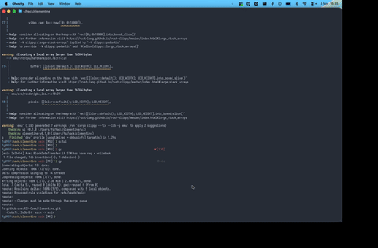

[](https://github.com/RIP-Comm/clementine/actions/workflows/rust.yml)



# Clementine - A collaborative approach to GBA emulation

Welcome to the first ripsters' project. Our goal is to understand how GameBoy Advance works and to create a modern emulator written in Rust (if you want to collaborate but you can't code in Rust take a look [here](https://doc.rust-lang.org/book/)).

Everything is work in progress. We will update this document a lot of times in this stage.


## Collaborative Guidelines

We love collaborating with others, so feel free to interact with us however you want. First of all, we strongly suggest you to enter in our Discord channel where you can find all of us ([here](https://discord.com/channels/919139369774891088/1013367016666714112)).

[Contributing doc](./CONTRIBUTING.md)

[Resources](https://github.com/RIP-Comm/clementine/wiki/Resources)

## Build and quick start

- clone the repository :)
- we are using `just` and not `make` then if you want take the benefit of this install it `cargo install just`

> Tip: Run `just` to see all the available commands

```zsh
# quick check all is working on you machine
just build
just test

# run a .gba file (debug build)
just run ~/Desktop/my_game.gba
```

## Requirements

Before running the emulator, you need:

1. **GBA BIOS file**: A file named `gba_bios.bin` (16KB) placed in the directory where you run the emulator. This is the GBA boot ROM and is required for the emulator to function.
   > Note: The BIOS path is currently hardcoded to `gba_bios.bin` in the current working directory.
2. **A GBA ROM file**: Any `.gba` ROM file you want to run.

## Running the Emulator

### Using Just Commands

| Command | Description |
|---------|-------------|
| `just run <rom>` | Run ROM in debug mode |
| `just run-release <rom>` | Run ROM in release mode (better performance) |
| `just run-log <rom>` | Run in debug mode with logging to file |
| `just run-release-log <rom>` | Run in release mode with logging to file |

**Examples:**
```zsh
# Run a game in debug mode
just run ~/roms/pokemon_emerald.gba

# Run with better performance (recommended for playing)
just run-release ~/roms/pokemon_emerald.gba

# Run with logging enabled (logs saved to temp directory)
just run-log ~/roms/pokemon_emerald.gba
```

### Logging

When `--log-to-file` is passed, logs are written to `clementine.log` in your system's temp directory. The path is printed at startup.

## Controls

| Key | GBA button |
|-----|------------|
| Z | A |
| X | B |
| Enter | Start |
| Backspace | Select |
| Arrow keys | D-pad |
| A | L |
| S | R |

Other keys:

- **Space** (default) — hold to fast-forward to 4x, release to return to the previous speed. The key can be rebound from the Cpu Handler panel.
- **F11** — toggle fullscreen.

## Saves

There are two independent save systems:

- **Battery saves** are the game's own in-game saves. Cartridge SRAM, Flash and EEPROM are persisted automatically to `<rom>.srm` next to the ROM and reloaded on launch, so saving inside a game just works across runs.
- **Save states** snapshot the full emulator state on demand from the Save Game panel, written to `<title>.sav` in the working directory. They are versioned and tied to the current build.

## Features

- **ARM7TDMI CPU** — ARM and Thumb instruction sets
- **LCD rendering** — Backgrounds (modes 0–5) including affine/mode-7 with per-scanline reference, sprites (regular, affine, semi-transparent), windowing, mosaic, and color blending effects (alpha, brightness)
- **Interrupts** — VBlank, HBlank, VCount, timers, DMA completion and keypad
- **DMA** — All four channels with immediate, VBlank, HBlank and sound-FIFO timing, hardware address/count masking
- **Audio** — DMA sound channels A/B (timer-driven FIFOs refilled by DMA) and the four PSG channels (2 square with sweep/envelope, wave, noise), mixed per SOUNDCNT with a DC-blocking filter, played through the host device with master volume/mute
- **Battery saves** — Cartridge SRAM, Flash (64K/128K) and EEPROM (512B/8K) persisted automatically to a `.srm` file next to the ROM, so in-game saving works across runs
- **Real-time clock** — S3511 RTC over GPIO, driven from the host clock (Pokemon Fire Red / Ruby family)
- **Input** — Keyboard-mapped GBA buttons plus a configurable hold-to-fast-forward key
- **Save/Load state** — Versioned save states with integrity checks (ROM/BIOS excluded from serialization), separate from battery saves
- **Speed control** — 1x/2x/4x/8x presets plus hold-to-fast-forward
- **Pokemon tools** — Party viewer, wild encounter patching (see below)

### Pokemon Debugger

A built-in tool for Gen 3 Pokemon games (accessible from the sidebar). Supported games:

| Game | Region | ROM Code |
|------|--------|----------|
| Pokemon FireRed | US | `BPRE` |
| Pokemon LeafGreen | US | `BPGE` |
| Pokemon Emerald | US | `BPEE` |
| Pokemon Ruby | US | `AXVE` |
| Pokemon Sapphire | US | `AXPE` |

**Party tab** - View your party Pokemon (species, level, stats, moves, held items). The game version is auto-detected from the ROM header.

**Wild tab** - Force all wild grass encounters to a specific Pokemon species and level. Search/select any of the 386 Pokemon by name, set a level, and click "Patch All Encounters". This patches the ROM encounter tables in memory (not on disk), so it resets when the emulator restarts.

## UI Tools

The emulator includes several debug tools accessible via the sidebar:

- **Gba Display** - Main game display (3x scale)
- **Cpu Handler** - Run/Pause/Step controls, speed presets (1x-8x), the fast-forward key binding, and breakpoints
- **Cpu Registers** - View ARM7TDMI register values
- **Disassembler** - Real-time disassembly of executed instructions
- **Save Game** - Save/Load state with version validation
- **ROM Info** - Cartridge header metadata and validity checks
- **Keypad Debug** - Inspect and toggle GBA button state
- **Memory Inspector** - Browse and edit memory regions
- **Sound** - Master volume and mute for audio output
- **Pokemon Debugger** - Party viewer and wild encounter cheats

## Development

| Command | Description |
|---------|-------------|
| `just build` | Build the entire project |
| `just test` | Run all tests across the workspace |
| `just lint` | Run clippy with strict configuration |
| `just fmt` | Format all code |
| `just check-fmt` | Check formatting without modifying |
| `just clean` | Clean build directory |
| `just doc` | Generate and open documentation |

### Documentation

The codebase is documented with Rust doc comments explaining how each component works. This is useful for understanding the GBA hardware and for contributors.

```zsh
# Generate and open documentation in your browser
just doc
```

## Architecture

The emulator uses a multi-threaded architecture:

- **UI Thread**: Runs the egui/eframe GUI at ~60fps
- **CPU Thread**: Runs the GBA emulation independently
- **Audio Thread**: A `cpal` callback pulls mixed samples the CPU thread produces

Communication between threads uses lock-free SPSC (single-producer, single-consumer) channels for commands (UI -> CPU), events (CPU -> UI) and audio samples (CPU -> audio device).

## Tests ROM

All tests + implementation are based on [jsmolka/gba-tests.git](https://github.com/jsmolka/gba-tests.git) + documentation in Wiki and online resources.

- [x] Thumb rom
- [x] ARM rom
- [x] Memory rom
- [x] Bios rom
