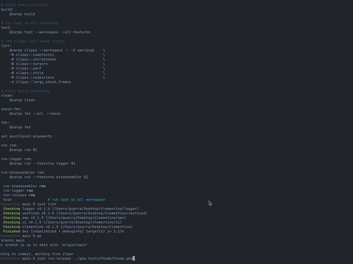

[](https://github.com/RIP-Comm/clementine/actions/workflows/rust.yml)



# Clementine - A collaborative approach to GBA emulation

Welcome to the first ripsters' project. Our goal is to understand how GameBoy Advance works and to create a modern emulator written in Rust (if you want to collaborate but you can't code in Rust take a look [here](https://doc.rust-lang.org/book/)).

Everything is work in progress. We will update this document a lot of times in this stage.


## Collaborative Guidelines

We love collaborating with others, so feel free to interact with us however you want. First of all, we strongly suggest you to enter in our Discord channel where you can find all of us ([here](https://discord.com/channels/919139369774891088/1013367016666714112)).

[Contributing doc](./CONTRIBUTING.md)

[Resources](https://github.com/RIP-Comm/clementine/wiki/Resources)

## Build and quick start

- clone the repository :)
- we are using `just` and not `make` then if you want take the benefit of this install it `cargo install just`

> Tip: Run `just` to see all the available commands

```zsh
# quick check all is working on you machine
just build
just test

# run a .gba file
cargo run -- ~/Desktop/my_game.gba
```

## Requirements

Before running the emulator, you need:

1. **GBA BIOS file**: A file named `gba_bios.bin` (16KB) placed in the directory where you run the emulator. This is the GBA boot ROM and is required for the emulator to function. It can be found online.
   > Note: The BIOS path is currently hardcoded to `gba_bios.bin` in the current working directory.
2. **A GBA ROM file**: Any `.gba` ROM file you want to run.

## Running the Emulator

All `just` commands are wrappers around `cargo run` for convenience. You can use `cargo run` directly if you need more control.

### Basic Usage

| Command | Description |
|---------|-------------|
| `just run <rom>` | Run ROM in debug mode |
| `just run-release <rom>` | Run ROM in release mode (better performance for animations) |

**Examples:**
```zsh
# Run a game in debug mode
just run ~/roms/pokemon_emerald.gba

# Run with better performance (recommended for playing)
just run-release ~/roms/pokemon_emerald.gba
```

### Debug Features

Clementine has optional debug features that can be enabled via Cargo features:

| Feature | Description |
|---------|-------------|
| `logger` | Enables verbose CPU/memory logging |
| `disassembler` | Adds a disassembler widget to the UI showing executed instructions |

#### Using Just Commands

| Command | Features Enabled | Description |
|---------|------------------|-------------|
| `just run-logger <rom>` | `logger` | Run with verbose logging to stdout |
| `just run-disassembler <rom>` | `disassembler` | Run with disassembler UI widget |
| `just run-all-debug <rom>` | `logger` + `disassembler` | Run with all debug features enabled |
| `just run-release-log-file <rom>` | `logger` | Release mode with logging to file |

**Examples:**
```zsh
# Debug CPU execution with verbose logs to stdout
just run-logger ~/roms/my_game.gba

# See disassembled instructions in a UI widget
just run-disassembler ~/roms/my_game.gba

# Full debugging experience (logs + disassembler)
just run-all-debug ~/roms/my_game.gba

# Release mode with logs saved to file (good for performance + debugging)
just run-release-log-file ~/roms/my_game.gba
```

#### Using Cargo Directly

For more control, you can use `cargo run` with feature flags:

```zsh
# Basic run
cargo run -- ~/roms/my_game.gba

# With logger feature (logs to stdout)
cargo run --features logger -- ~/roms/my_game.gba

# With logger feature (logs to file instead of stdout)
cargo run --features logger -- ~/roms/my_game.gba --log-on-file

# With disassembler feature
cargo run --features disassembler -- ~/roms/my_game.gba

# With multiple features
cargo run --features logger --features disassembler -- ~/roms/my_game.gba

# Release mode with features
cargo run --release --features logger -- ~/roms/my_game.gba --log-on-file
```

## Documentation

The codebase is documented with Rust doc comments explaining how each component works. This is useful for understanding the GBA hardware and for contributors.

```zsh
# Generate and open documentation in your browser
just doc
```

## Tests ROM

All tests + implementation are based on [jsmolka/gba-tests.git](https://github.com/jsmolka/gba-tests.git) + documentation in Wiki and online resources.

- [x] Thumb rom
- [x] ARM rom
- [x] Memory rom
- [x] Bios rom
